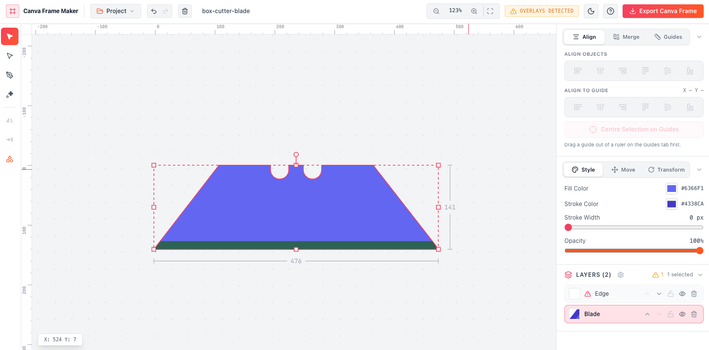

# Canva Frame Maker

Convert images and custom vector shapes into importable Canva Frames — with pen/bezier
tools, boolean operations, alignment helpers, and overlay validation.



## Requirements

- Node.js >= 20
- pnpm >= 10 (`corepack enable pnpm`)

## Run locally

```bash
pnpm install
pnpm dev
```

**Dev Port:** http://localhost:3000.

## Scripts

| Script         | What it does                       |
| -------------- | ---------------------------------- |
| `pnpm dev`     | Vite dev server on port 3000       |
| `pnpm build`   | Production build to `dist/`        |
| `pnpm preview` | Serve the production build locally |
| `pnpm lint`    | Type-check with `tsc --noEmit`     |
| `pnpm clean`   | Remove `dist/`                     |

## Stack

- React 19 + TypeScript
- Vite 6
- Tailwind CSS 4 (`@tailwindcss/vite`)
- `polygon-clipping` for boolean path operations
- `pdf-lib` for PDF export
- `lucide-react` icons
